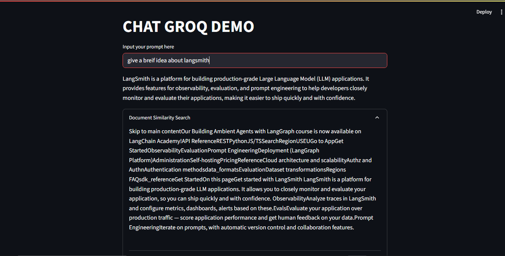

## This is a Simple Chatbot with web based loader, Groq and Advance RAG
- It uses retriever to retrieve the data from the web only 
- Then it store it into vector store which is FAISS here in form of embeddings
- For embeddings it uses cohere embeddings
- Then it uses retriever and 'llama3-8b-8192' model to response on the basis of context and user question

